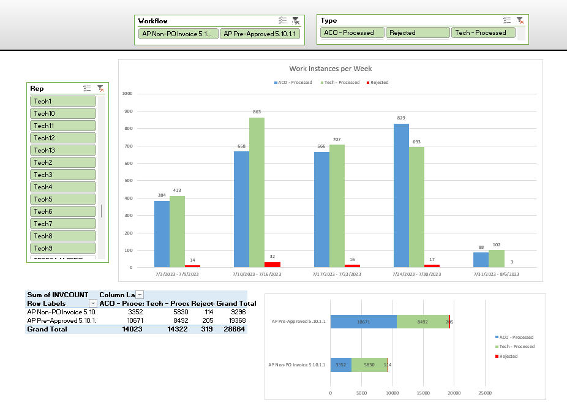
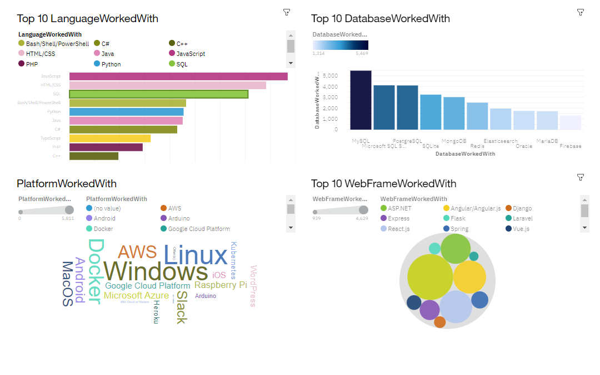
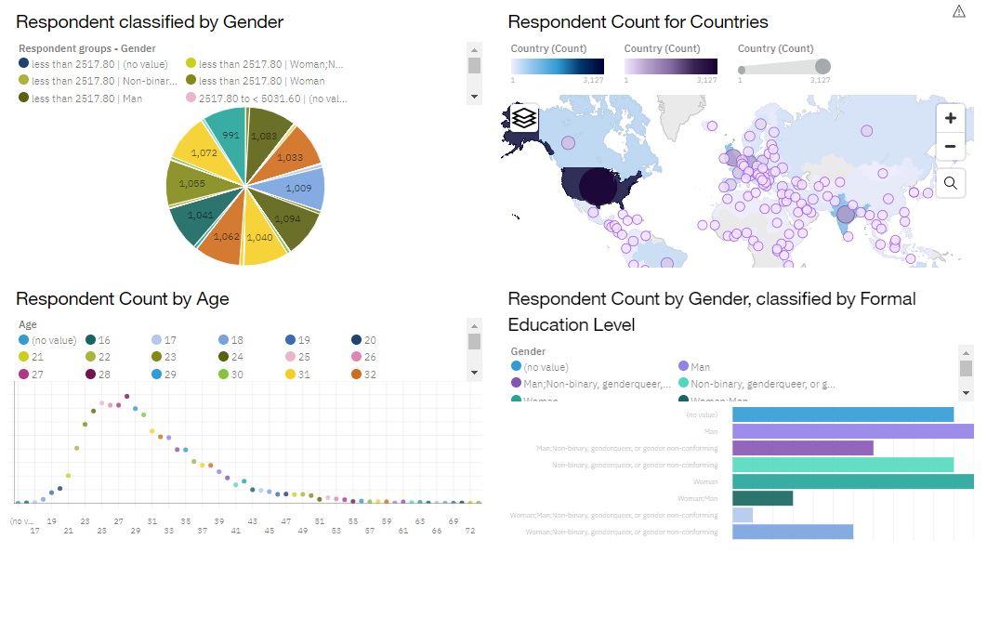
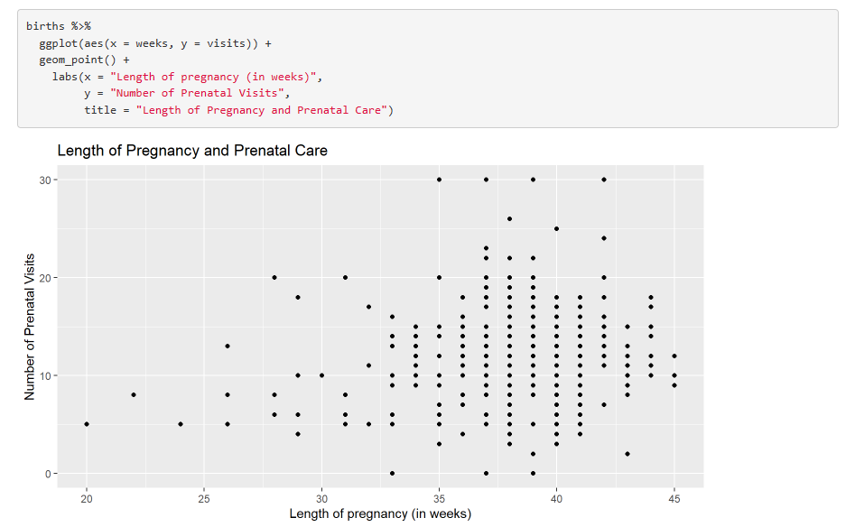
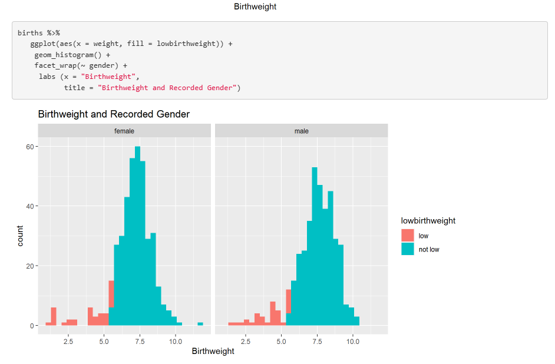

# Data Analyst

### Technical Skills: RStudio | Power BI | Power Query | SQL | Microsoft Office 

### Education 
- B.S., Data Science/Neuroscience | Arizona State University (_August 2024_)
- A.S., Psychology | Daytona State College (_August 2022_)

## Work Experience 
** Data Analyst @ Chugach (_October 2023 - Present_)**
 - Gathered and analyzed data for the financial center of the Department of Homeland Security.
 - Transformed and told stories through data visualization and dashboarding using Power BI and Power Query.

** Senior Systems Analyst @ US Navy (_2020 - 2023_)**
 - Collaborated with architects to develop and implement data-driven strategies.
 - Coded and developed scenarios using C++ based language. 

** Senior Database Administrator @ US Navy (_2020 - Present_)**
 - Developed, constructed and maintained data pipelines, data warehouses and ETLs.
 - Improved data quality and efficiency using streamlining methods. 

** Data Analyst @ US Navy (_2017 - 2020_)**
  - Supported evaluation of capability requirements and objectives.
  - Developed visualization methods for reporting. 

** Database Administrator @ US Navy (_2016 - 2017_)***
  - Gathered, developed and maintained database using excel and R.
  - Supported NATO efforts in Greece using data-driven strategies.

### Projects

Dashboarding:

RCodes:

