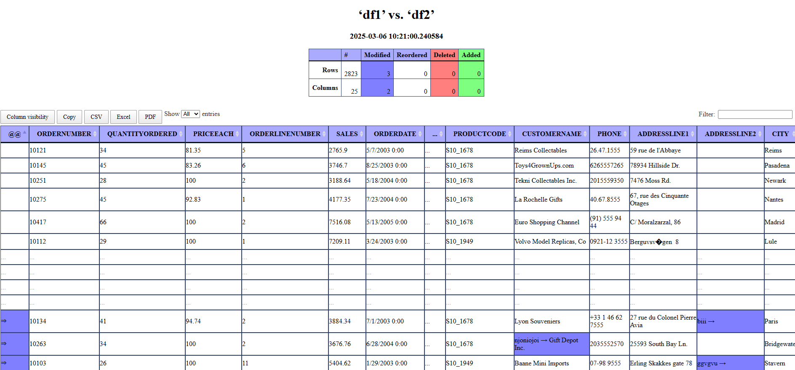
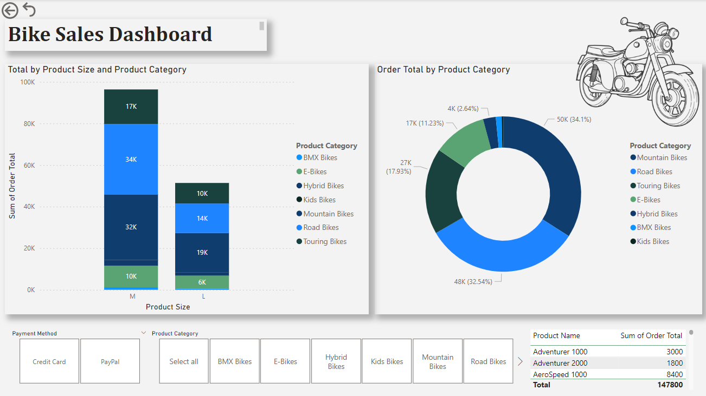
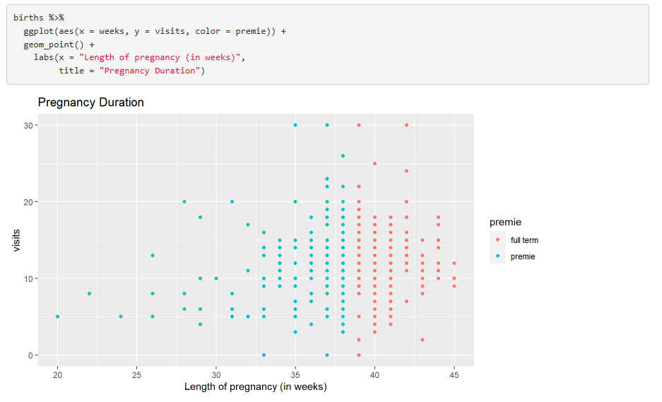
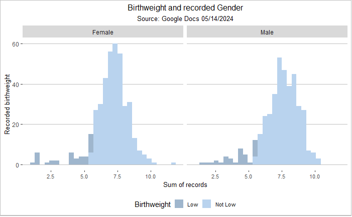

# Data Scientist

### Technical Skills
Languages & Analytics: R, SQL
Data & BI: Power BI, Power Query
Platforms & Tooling: Azure DevOps, GitHub
Productivity: Microsoft Office

# Projects

## Data Comparison & Validation Reporting (CSV vs Parquet)

Developed a structured difference reporting workflow to compare outputs generated from CSV and Parquet pipelines.
This solution enables rapid identification of discrepancies when validating new code changes or data transformations, supporting safer releases and regression checks.

Key capabilities:
-Column-level comparisons
-Row-level difference detection
-Output formatted for rapid review by analysts and developers

## Dashboarding & Data Visualization (Power BI)

Motorcycle Sales Dashboard
Built an interactive Power BI dashboard using a sample motorcycle sales dataset to surface trends in sales volume, pricing, and product mix.
 

 
Technology Trends Dashboard

Designed dashboards highlighting the top 10 nationally in-demand:
-Programming languages
-Databases
-Platforms
-Web frameworks
Visualizations were structured to support comparative analysis and executive-level consumption.

 
Survey Analytics Dashboard

Created an interactive dashboard analyzing survey responses across:
-Gender
-Age
-Geographic origin
-Education level
This project focused on filter-driven exploration and stakeholder-friendly storytelling.
 

## R Code Examples & Exploratory Analysis
Pregnancy Length vs Prenatal Visits

Developed R visualizations analyzing the relationship between pregnancy duration and the number of prenatal visits.
 

 
 
Premature vs Full-Term Births

Produced a color-coordinated comparison plot distinguishing premature and full-term births to support categorical analysis.
 
 
 
Birthweight Distribution by Sex

Built histograms comparing male and female birthweights to highlight distributional differences and variance.
 

