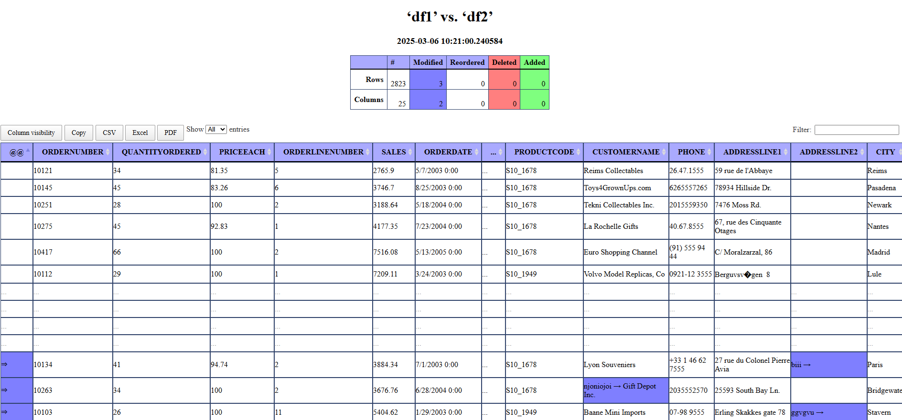
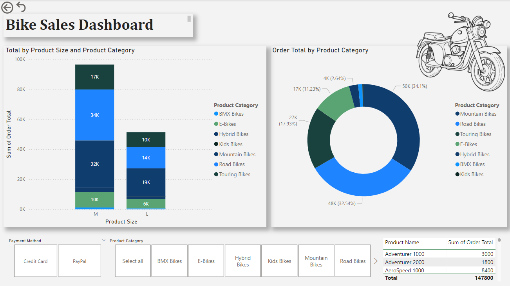
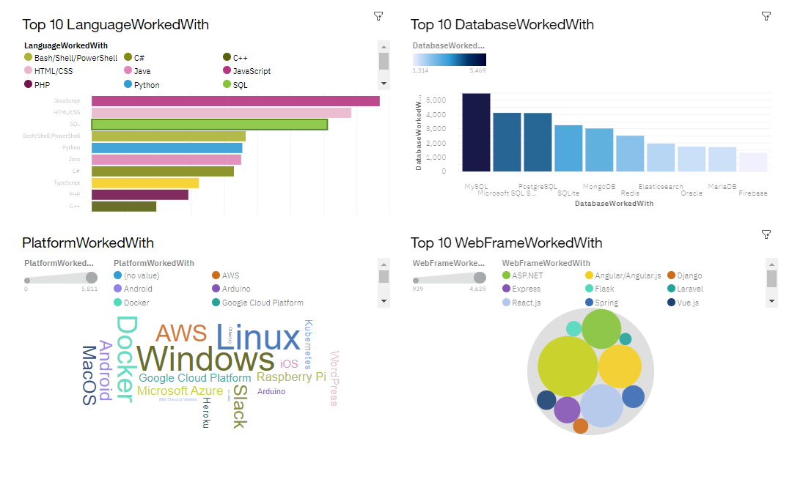
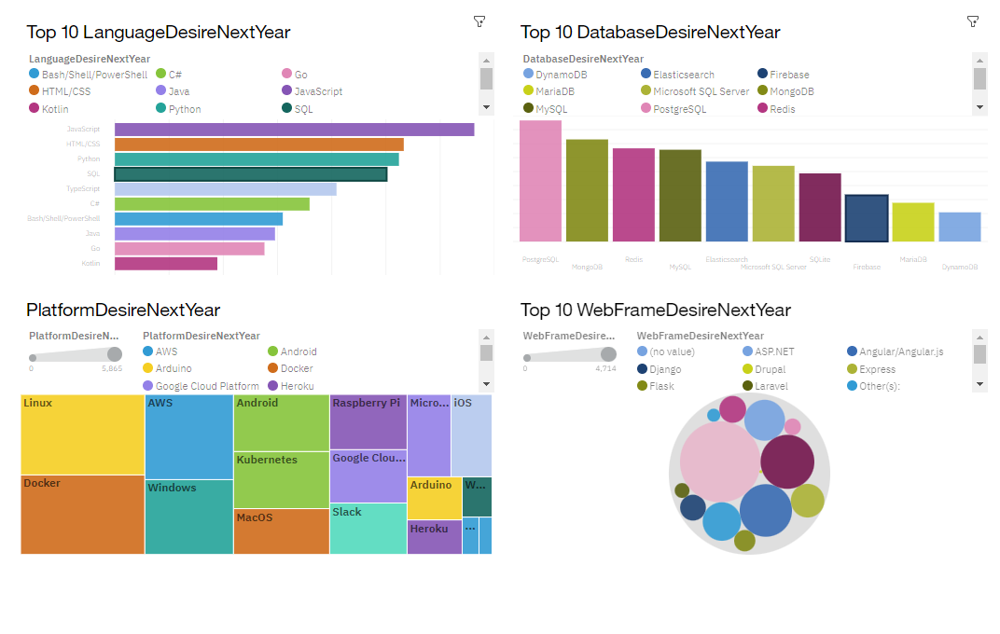
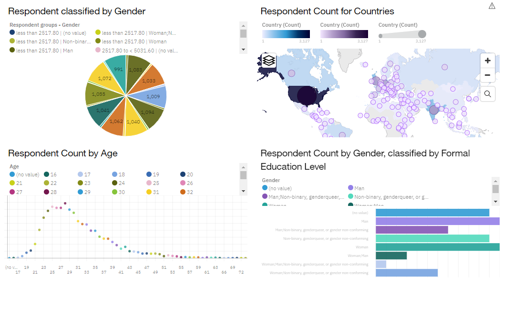
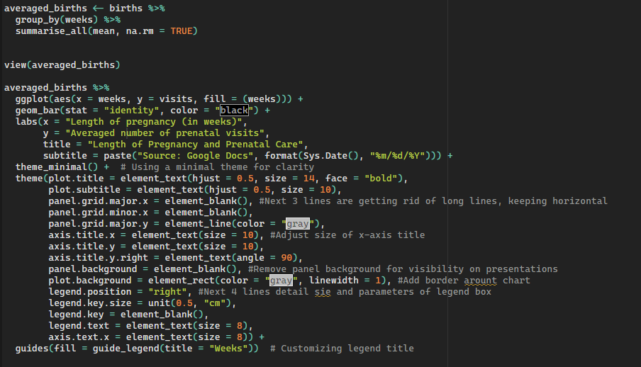
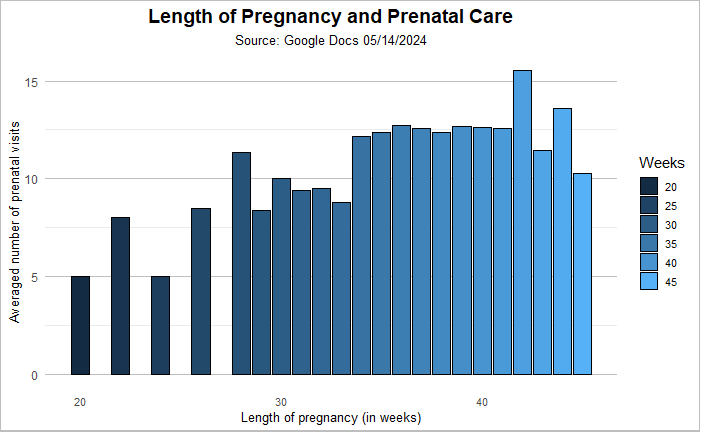
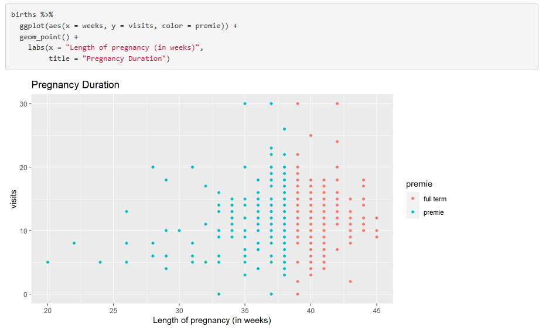
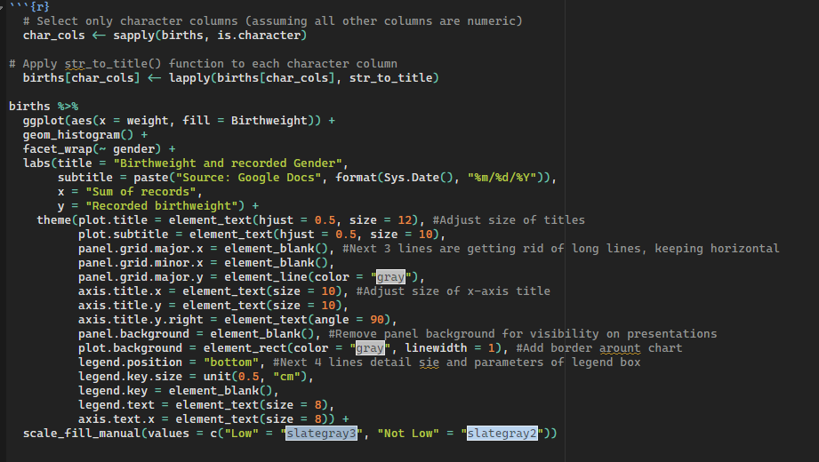
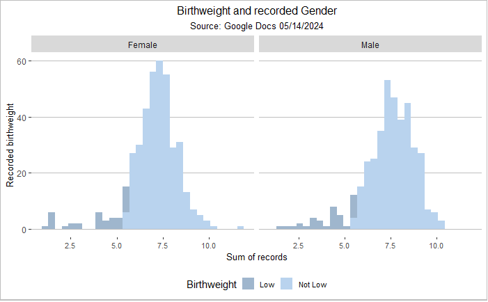

# Harlee Scordo

### Data Platform Engineer | Data Architecture | Analytics Systems

Designing governed data frameworks, validation systems, and analytics platforms for enterprise environments.

Active Secret Clearance

---

## About

I am a Data Platform Engineer specializing in data quality, validation frameworks, ETL architecture, and governed analytics environments.

My work focuses on transforming complex or poorly documented data systems into maintainable, reproducible, and auditable solutions through automation, documentation, and architectural standards.

I currently design and support reusable analytics frameworks, validation systems, and enterprise data workflows using R, SQL, Azure DevOps, GitHub, and Power BI.

## Portfolio Navigation

- [Featured Project](#featured-project)
- [Technical Skills](#technical-skills)
- [What I Build](#what-i-build)
- [How I Work](#how-i-work)
- [Contact](#contact)

---

## Core Areas

### Data Architecture

* Contract-Driven Data Design
* Data Governance
* Metadata Management
* Validation Frameworks
* Documentation Automation

### Data Engineering

* ETL Framework Design
* Data Quality Controls
* Data Validation Pipelines
* Reproducible Analytics
* Automation Workflows

### Analytics Platforms

* Power BI
* Power Query
* Dashboard Development
* Reporting Solutions

### Development & Delivery

* R
* SQL
* Git
* GitHub
* Azure DevOps
* CI/CD Concepts

---

# Featured Projects

---

## Enterprise Data Intake & Validation Framework

Designed and implemented a contract-driven data intake framework that standardizes ingestion, validation, documentation, and governance of heterogeneous datasets.

The framework uses machine-readable schema contracts, automated validation reporting, generated data catalogs, and reproducible execution environments to support analytics workflows in regulated and enterprise environments.

### Demonstrated Capabilities

* Contract-driven architecture
* Automated data quality validation
* Documentation generation
* Metadata management
* Reproducible execution using renv
* CI/CD-oriented design
* Governance-focused development
* Architecture decision documentation

### Technologies

R • SQL • YAML • Git • GitHub • Azure DevOps • Quarto

### Key Deliverables

* Automated Data Catalog Generation
* Schema Contract Validation
* Validation Summary Reporting
* Architecture Documentation
* Architecture Decision Records (ADRs)

### Repository

[Enterprise Data Intake Framework](https://github.com/HarleeScordo/Portfolio_Repo)

### Example Outputs

#### Data Catalog

[View Data Catalog](https://github.com/HarleeScordo/Portfolio_Repo/blob/main/docs/DATA_CATALOG.md)

#### Validation Summary

[View Validation Results](https://github.com/HarleeScordo/Portfolio_Repo/blob/main/output/validation/validation_summary.csv)

---

## Data Comparison & Validation Reporting

Developed a structured validation workflow for comparing outputs generated from independent processing pipelines.

The solution enables rapid identification of discrepancies when validating new code changes, ETL transformations, and migration efforts.

### Demonstrated Capabilities

* Data validation
* Regression testing support
* Difference reporting
* Data quality assurance
* Release verification

### Key Features

* Column-level comparisons
* Row-level discrepancy detection
* Human-readable output reporting
* Rapid analyst review workflows

### Technologies

R • CSV • Parquet • Data Validation

---

## Analytics Dashboards

Designed and developed interactive dashboards supporting executive reporting, technology trend analysis, sales analytics, and survey reporting.

These dashboards were built to emphasize usability, stakeholder communication, and decision support.

### Technologies

Power BI • Power Query • Data Modeling • Visualization

---

### Motorcycle Sales Dashboard

Interactive dashboard highlighting sales trends, pricing performance, and product mix analysis.

---

### Technology Trends Dashboard

Dashboard analyzing nationally in-demand:

* Programming Languages
* Databases
* Platforms
* Web Frameworks

Designed to support comparative analysis and executive-level consumption.

---

### Survey Analytics Dashboard

Interactive dashboard analyzing survey responses across:

* Gender
* Age
* Geographic Origin
* Education Level

Focused on stakeholder-friendly reporting and filter-driven exploration.

---

## Exploratory Data Analysis & Statistical Visualization

Collection of exploratory analyses and visualizations developed in R to investigate trends, distributions, and relationships within real-world datasets.

### Technologies

R • ggplot2 • Statistical Analysis • Data Visualization

---

### Pregnancy Length vs Prenatal Visits

Visualization exploring the relationship between pregnancy duration and prenatal care utilization.

---

### Premature vs Full-Term Birth Analysis

Comparative visualization distinguishing premature and full-term births to support categorical analysis and interpretation.

---

### Birthweight Distribution by Sex

Histogram-based analysis comparing birthweight distributions across male and female births.

---

# Technical Skills

## Languages

* R
* SQL

## Data Engineering & Analytics

* ETL Design
* Data Validation
* Data Quality Frameworks
* Metadata Management
* Documentation Automation

## Business Intelligence

* Power BI
* Power Query

## Development Platforms

* Azure DevOps
* GitHub
* Git

## Analytics & Reporting

* Dashboard Design
* Statistical Analysis
* Data Visualization

---

# Currently Building

### ETL Modernization & Architecture Case Study

Documenting the redesign of a legacy analytics workflow through:

* Runtime optimization
* Architecture simplification
* Error visibility improvements
* Documentation standards
* Development workflow standardization

Focus areas include maintainability, scalability, observability, and governance.

---

# Contact

### GitHub

https://github.com/HarleeScordo

### LinkedIn

Add your LinkedIn URL here
