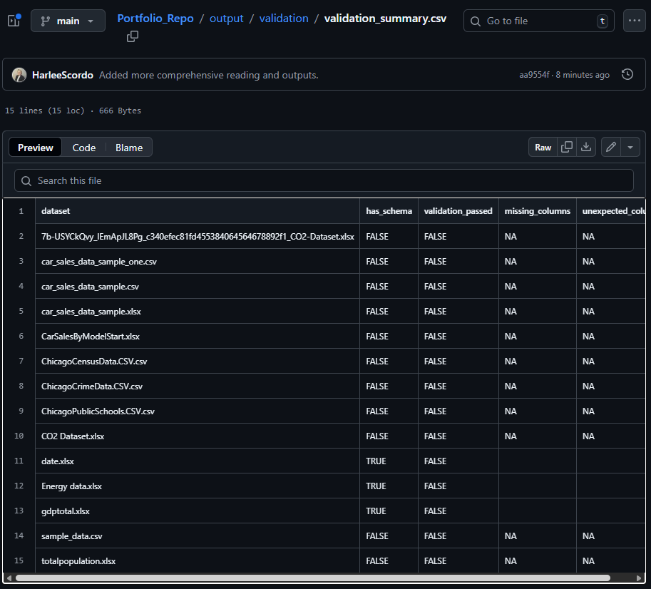

<main markdown="1">

# Harlee Scordo

## Data Platform Engineer | Data Architecture | Analytics Systems

Designing governed data frameworks, validation systems, and analytics platforms for enterprise environments.

Active Secret Clearance

---

## About

I am a Data Platform Engineer specializing in data quality, validation frameworks, ETL architecture, and governed analytics environments.

My work focuses on transforming complex or poorly documented data systems into maintainable, reproducible, and auditable solutions through automation, documentation, and architectural standards.

I currently design and support reusable analytics frameworks, validation systems, and enterprise data workflows using R, SQL, Azure DevOps, GitHub, and Power BI.

---

## Core Areas

### Data Architecture

- Contract-Driven Data Design
- Data Governance
- Metadata Management
- Validation Frameworks
- Documentation Automation

### Data Engineering

- ETL Framework Design
- Data Quality Controls
- Data Validation Pipelines
- Reproducible Analytics
- Automation Workflows

### Analytics Platforms

- Power BI
- Power Query
- Dashboard Development
- Reporting Solutions

---

## Featured Projects

### Enterprise Data Intake & Validation Framework

Designed and implemented a contract-driven data intake framework that standardizes ingestion, validation, documentation, and governance of heterogeneous datasets.

[Enterprise Data Intake Framework](https://github.com/HarleeScordo/Portfolio_Repo)

[View Data Catalog](https://github.com/HarleeScordo/Portfolio_Repo/blob/main/docs/DATA_CATALOG.md)

[View Validation Results](https://github.com/HarleeScordo/Portfolio_Repo/blob/main/output/validation/validation_summary.csv)

---

## Technical Skills

### Languages

- R
- SQL

### Data Engineering & Analytics

- ETL Design
- Data Validation
- Data Quality Frameworks
- Metadata Management
- Documentation Automation

### Business Intelligence

- Power BI
- Power Query

### Development Platforms

- Azure DevOps
- GitHub
- Git

---

## Currently Building

### ETL Modernization & Architecture Case Study

Documenting the redesign of a legacy analytics workflow through runtime optimization, architecture simplification, error visibility improvements, documentation standards, and workflow standardization.

---

## Contact

### GitHub

https://github.com/HarleeScordo

### LinkedIn

https://www.linkedin.com/in/harleescordo/

</main>

<aside class="toc" markdown="1">

### Portfolio Navigation

- [About](#about)
- [Core Areas](#core-areas)
- [Featured Projects](#featured-projects)
- [Technical Skills](#technical-skills)
- [Currently Building](#currently-building)
- [Contact](#contact)

</aside>

