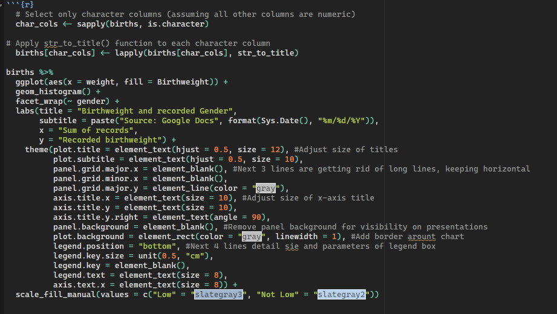
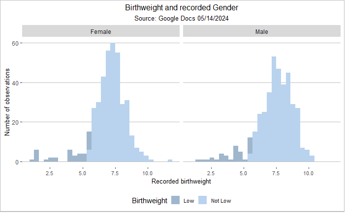

# Data Scientist

### Technical Skills
Languages & Analytics: R, SQL
Data & BI: Power BI, Power Query
Platforms & Tooling: Azure DevOps, GitHub
Productivity: Microsoft Office

### Education 
- M.S., Data Science | University of Virginia
- B.S., Data Science/Neuroscience | Arizona State University 
- A.S., Psychology | Daytona State College 

### Projects

## Data Comparison & Validation Reporting (CSV vs Parquet)

Developed a structured difference reporting workflow to compare outputs generated from CSV and Parquet pipelines.
This solution enables rapid identification of discrepancies when validating new code changes or data transformations, supporting safer releases and regression checks.

Key capabilities:

Column-level comparisons

Row-level difference detection

Output formatted for rapid review by analysts and developers

## Dashboarding & Data Visualization (Power BI)

Motorcycle Sales Dashboard
Built an interactive Power BI dashboard using a sample motorcycle sales dataset to surface trends in sales volume, pricing, and product mix.
 

 
Technology Trends Dashboard

Designed dashboards highlighting the top 10 nationally in-demand:

-Programming languages
-Databases
-Platforms
-Web frameworks

Visualizations were structured to support comparative analysis and executive-level consumption.

 
Survey Analytics Dashboard
Created an interactive dashboard analyzing survey responses across:
-Gender
-Age
-Geographic origin
-Education level
This project focused on filter-driven exploration and stakeholder-friendly storytelling.
 

## R Code Examples & Exploratory Analysis
Pregnancy Length vs Prenatal Visits

Developed R visualizations analyzing the relationship between pregnancy duration and the number of prenatal visits.
 

 
 
Premature vs Full-Term Births

Produced a color-coordinated comparison plot distinguishing premature and full-term births to support categorical analysis.
 
 
 
Birthweight Distribution by Sex

Built histograms comparing male and female birthweights to highlight distributional differences and variance.
 

## Work Experience 

**Power Platform Innovator @ Teksouth (_June 2024 - Present_)**
-	Developed dynamic data solutions using R for US Air Force clients, improving data extraction, transformation, and loading (ETL) processes.
-	Implemented PowerBI and Power Apps to automate and optimize data management workflows for improved organizational efficiency.

**Data Analyst @ Chugach (_October 2023 - June 2024_)**
 - Gathered and analyzed data for the financial center of the Department of Homeland Security.
 - Transformed and told stories through data visualization and dashboarding using Power BI and Power Query.

**Senior Systems Analyst @ US Navy (_2020 - 2023_)**
 - Collaborated with architects to develop and implement data-driven strategies.
 - Coded and developed scenarios using C++ based language. 

**Senior Database Administrator @ US Navy (_2020 - Present_)**
 - Developed, constructed and maintained data pipelines, data warehouses and ETLs.
 - Improved data quality and efficiency using streamlining methods. 

**Data Analyst @ US Navy (_2017 - 2020_)**
  - Supported evaluation of capability requirements and objectives.
  - Developed visualization methods for reporting. 

**Database Administrator @ US Navy (_2016 - 2017_)***
  - Gathered, developed and maintained database using excel and R.
  - Supported NATO efforts in Greece using data-driven strategies.

